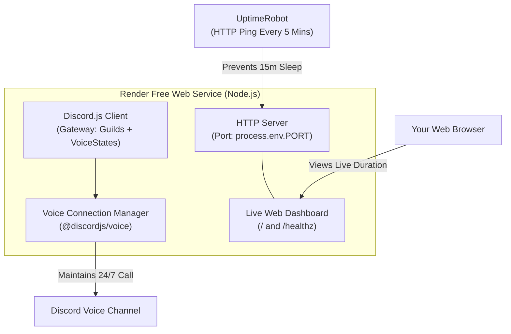

<div align="center">

# ⚡ Discord Call Keeper

**A resilient, 24/7 Discord voice channel keeper built with TypeScript, Discord.js v14, and an embedded live status web dashboard.**

[](https://www.typescriptlang.org/)
[](https://discord.js.org/)
[](https://nodejs.org/)
[](https://render.com/)
[](LICENSE)

<p align="center">
  <a href="#-features">Features</a> &bull;
  <a href="#-how-it-works">How It Works</a> &bull;
  <a href="#-quick-start">Quick Start</a> &bull;
  <a href="#-deployment-render--uptimerobot">Render & UptimeRobot Setup</a> &bull;
  <a href="#-environment-variables">Configuration</a> &bull;
  <a href="#-faq--troubleshooting">FAQ</a>
</p>

</div>

---

## 📖 Overview

Have you ever had a Discord call going for hundreds of hours, only for everyone to fall asleep or disconnect, instantly resetting the call time back to zero?

**Discord Call Keeper** is a lightweight, dedicated bot designed to remain in your server's voice channel **24/7**. It holds the call open indefinitely, ensuring the call duration is never lost.

It comes out of the box with an **embedded HTTP health server & sleek web dashboard** tailored to keep free cloud tiers (like **Render**) running around the clock when paired with **UptimeRobot**.

---

## ✨ Features

- 🟢 **Continuous 24/7 Voice Presence**: Joins your designated server voice channel and stays connected perpetually.
- 🔄 **Intelligent Auto-Reconnect**: Automatically recovers from network dropouts, Discord voice server migrations, and connection errors.
- 🛡️ **Privacy & Bandwidth Optimized**: Automatically self-deafens (`selfDeaf: true`) and self-mutes (`selfMute: true`) on connection. Zero voice data is captured or streamed.
- 📊 **Built-in Web Dashboard**: Sleek, modern dark-mode status page displaying live connected uptime, channel name, guild name, ping, and memory usage.
- 💓 **Health-Check API (`/healthz`)**: Returns clean JSON health metrics for monitoring services.
- ☁️ **Render Free Tier Ready**: Fully configured to prevent idle spin-down when pinged every 5 minutes by UptimeRobot.
- 🔒 **Secure by Design**: Strict environment variable loading and validation, preventing startup with missing secrets.
- ⚡ **Zero Privileged Intents Required**: No need to enable privileged intents (like Message Content) in the Discord Developer Portal.

---

## 🛠️ How It Works



1. **Discord Gateway**: The bot connects to Discord's gateway and joins the target voice channel.
2. **HTTP Server**: An embedded HTTP server listens on the assigned port.
3. **UptimeRobot**: Pings the bot's URL every 5 minutes, preventing Render's free tier from sleeping after 15 minutes of inactivity.
4. **Watchdog**: A 30-second interval monitors the voice socket and triggers immediate reconnection if the connection drops.

---

## 🚀 Quick Start (Local Setup)

### Prerequisites

- [Node.js](https://nodejs.org/) (version 18 or higher)
- [pnpm](https://pnpm.io/) (or `npm`)
- A Discord account with administrative permissions on your server

### 1. Clone & Install Dependencies

```bash
git clone https://github.com/your-username/discord-call-keeper.git
cd discord-call-keeper
pnpm install
# or: npm install
```

### 2. Configure Environment Variables

Copy `.env.example` to create your local `.env` file:

```bash
cp .env.example .env
```

Open `.env` and fill in your details:

```env
DISCORD_TOKEN=your_bot_token_here
GUILD_ID=your_server_id_here
CHANNEL_ID=your_voice_channel_id_here
PORT=3000
```

### 3. Build & Run

**Development Mode (with hot-reloading):**
```bash
pnpm dev
# or: npm run dev
```

**Production Build:**
```bash
pnpm build
pnpm start
# or: npm run build && npm start
```

Once started, open [http://localhost:3000](http://localhost:3000) in your browser to view the live dashboard!

---

## 🤖 Discord Developer Portal Setup

Follow these steps to create and configure your bot:

### Step 1: Create the Application
1. Go to the [Discord Developer Portal](https://discord.com/developers/applications).
2. Click **New Application** (top right) and give it a name (e.g., `Call Keeper`).
3. Navigate to the **Bot** tab on the left sidebar.
4. Click **Reset Token**, copy the generated token, and save it for your `DISCORD_TOKEN`.

### Step 2: Bot Permissions & Intents
* Under **Privileged Gateway Intents**, **NONE** are required! You do not need to check any boxes here.
* Under **Bot Permissions**, ensure the following voice permissions are granted:
  - `View Channel`
  - `Connect`
  - `Speak`

### Step 3: Invite the Bot to Your Server
1. Go to the **OAuth2** tab > **URL Generator** on the left sidebar.
2. Under **Scopes**, check:
   - `bot`
3. Under **Bot Permissions**, check:
   - `View Channel`
   - `Connect`
   - `Speak`
4. Copy the generated URL at the bottom and paste it into your browser to invite the bot to your server.

---

## 🔍 How to Find Guild ID and Channel ID

1. In the Discord desktop or web app, go to **User Settings (Gear Icon)** > **Advanced**.
2. Toggle on **Developer Mode**.
3. **Get Guild ID (Server ID)**: Right-click your server's icon in the server list and click **Copy Server ID**.
4. **Get Channel ID**: Right-click the voice channel you want the bot to join and click **Copy Channel ID**.

---

## 🌐 Deployment (Render + UptimeRobot 24/7)

Render offers a generous free tier for Web Services that, when kept awake with UptimeRobot, can run continuously.

### Part A: Deploy to Render

1. **Push your code to GitHub**:
   Ensure you commit everything **except** `.env` (the included `.gitignore` already protects your secrets).

2. **Create a Web Service on Render**:
   - Log in to [Render](https://render.com/).
   - Click **New +** > **Web Service**.
   - Connect your GitHub repository.
   - Configure the following settings:
     - **Name**: `discord-call-keeper`
     - **Runtime**: `Node`
     - **Build Command**: `pnpm install && pnpm build` (or `npm install && npm run build`)
     - **Start Command**: `pnpm start` (or `npm start`)
     - **Instance Type**: `Free`

3. **Add Environment Variables**:
   Under the **Environment Variables** section on Render, add:
   | Key | Value |
   | :--- | :--- |
   | `DISCORD_TOKEN` | *Your bot token* |
   | `GUILD_ID` | *Your server ID* |
   | `CHANNEL_ID` | *Your voice channel ID* |
   | `PORT` | `10000` |

4. **Deploy**:
   Click **Create Web Service**. Render will build and launch your bot. Once deployed, Render will provide a public URL (e.g., `https://discord-call-keeper.onrender.com`).

---

### Part B: Keep Awake with UptimeRobot

Render's free tier automatically spins down after 15 minutes of inactivity (no HTTP traffic). To keep your bot running 24/7:

1. Sign up for a free account at [UptimeRobot](https://uptimerobot.com/).
2. On your UptimeRobot dashboard, click **+ Add New Monitor**.
3. Configure the monitor:
   - **Monitor Type**: `HTTP(s)`
   - **Friendly Name**: `Discord Call Keeper`
   - **URL (or IP)**: `https://your-app-name.onrender.com/healthz` (or your root URL)
   - **Monitoring Interval**: `Every 5 minutes`
4. Click **Create Monitor**.

🎉 **That's it!** UptimeRobot will ping your Render service every 5 minutes, preventing it from ever going to sleep.

---

## ⚙️ Environment Variables Reference

| Variable | Required | Description | Example |
| :--- | :---: | :--- | :--- |
| `DISCORD_TOKEN` | **Yes** | Your Discord Bot Token from the Developer Portal. | `MTE...` |
| `GUILD_ID` | **Yes** | The numeric ID of the Discord server. | `123456789012345678` |
| `CHANNEL_ID` | **Yes** | The numeric ID of the target voice channel. | `876543210987654321` |
| `PORT` | No | HTTP port for the dashboard & health check (Defaults to `3000`, Render uses `10000`). | `3000` |

---

## ❓ FAQ & Troubleshooting

### Can this bot join a private Group DM or 1-on-1 DM call?
**No.** Official Discord bots can only connect to voice channels located within **Discord Servers (Guilds)**. Discord's API does not permit bots to participate in private Group DMs. Attempting to use a user account ("self-bot") to join DM calls violates Discord's Terms of Service.

### The bot got moved or disconnected from the voice channel?
- **Check AFK Channel Settings**: In your Server Settings > Overview, check if your server has an **Inactive Channel (AFK Channel)** configured. If the bot is placed in an AFK channel or if inactive users are moved, adjust permissions or exempt the bot's role from AFK timeouts.
- **Auto-Reconnect**: If the bot is disconnected due to a voice server update or temporary network glitch, it will automatically reconnect within seconds.

### How does Render's free tier quota work?
Render provides **750 free instance hours per calendar month** for free tier accounts. 
- A 31-day month has $31 \times 24 = 744$ hours.
- As long as this is the **only** active free web service on your Render account, it will run continuously throughout the entire month without exhausting your free hours.

---

## 📄 License

This project is licensed under the [MIT License](LICENSE). You are free to use, modify, and distribute it.
